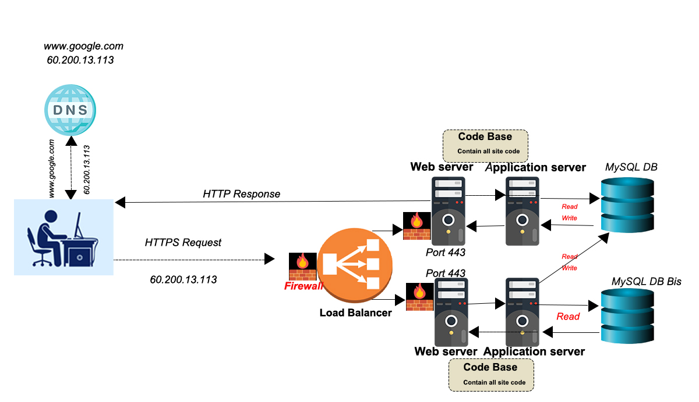

# 🚀 What Happens When You Type https://www.google.com

<div style="text-align: center; margin-bottom: 30px;">
  
</div>

<div style="background: linear-gradient(135deg, #4285F4, #34A853, #FBBC05, #EA4335); padding: 25px; border-radius: 15px; margin-bottom: 35px; box-shadow: 0 10px 20px rgba(0,0,0,0.19), 0 6px 6px rgba(0,0,0,0.23);">
<h2 style="color: white; text-shadow: 2px 2px 4px rgba(0,0,0,0.3); font-size: 28px;">✨ THE INTERNET MAGIC: From Keypress to Google's Response ✨</h2>
<p style="color: white; font-style: italic; font-size: 18px; margin-top: 10px;">A fascinating journey through the digital universe that happens in milliseconds</p>
</div>

## 🔍 1. DNS Resolution Process

<div style="display: flex; align-items: center; margin-bottom: 20px;">
  <div style="flex: 0 0 100px; margin-right: 20px;">
    <svg xmlns="http://www.w3.org/2000/svg" viewBox="0 0 100 100" width="100" height="100">
      <circle cx="50" cy="40" r="25" fill="#43cea2" stroke="#185a9d" stroke-width="3"/>
      <path d="M45 40 L85 80" stroke="#185a9d" stroke-width="6"/>
      <rect x="70" y="70" width="30" height="20" rx="5" fill="#43cea2" stroke="#185a9d" stroke-width="2"/>
      <text x="75" y="85" font-family="Arial" font-size="10" fill="white">DNS</text>
      <path d="M30 30 L45 45 M30 45 L45 30" stroke="#185a9d" stroke-width="3"/>
    </svg>
  </div>
  <div style="flex: 1;">
    <div style="background: linear-gradient(to right, #43cea2, #185a9d); padding: 20px; border-radius: 12px; box-shadow: 0 4px 8px rgba(0,0,0,0.2); margin-bottom: 0; border: 2px solid #43cea2;">
    <p style="color: white; font-size: 17px; text-shadow: 1px 1px 2px rgba(0,0,0,0.2);"><strong style="font-size: 18px;">In Simple Words:</strong> Think of this like looking up a phone number. Your computer needs to find out exactly where Google is on the internet.</p>
    </div>
  </div>
</div>

### Technical Details:

<div style="background-color: #1a1a2e; border-radius: 8px; padding: 15px; margin: 15px 0; box-shadow: 0 4px 6px rgba(0,0,0,0.1);">
<pre style="color: #00ff99; font-family: 'Courier New', monospace; font-weight: bold;">Step 1: Check local cache
Step 2: Ask DNS server 
Step 3: Find Google's IP address</pre>
</div>

<ul style="list-style-type: none; padding-left: 10px;">
  <li style="margin-bottom: 8px; position: relative; padding-left: 25px;"><span style="position: absolute; left: 0; color: #4285F4;">➤</span> Your browser looks up "www.google.com" in your computer's memory</li>
  <li style="margin-bottom: 8px; position: relative; padding-left: 25px;"><span style="position: absolute; left: 0; color: #4285F4;">➤</span> If not found, it asks your Internet provider's DNS server</li>
  <li style="margin-bottom: 8px; position: relative; padding-left: 25px;"><span style="position: absolute; left: 0; color: #4285F4;">➤</span> The DNS server returns Google's IP address (like 142.250.74.100)</li>
</ul>

---

## 🤝 2. TCP/IP Connection Establishment

<div style="display: flex; align-items: center; margin-bottom: 20px;">
  <div style="flex: 0 0 100px; margin-right: 20px;">
    <svg xmlns="http://www.w3.org/2000/svg" viewBox="0 0 100 100" width="100" height="100">
      <rect x="10" y="30" width="30" height="40" rx="5" fill="#6D6027" stroke="#D3CBB8" stroke-width="2"/>
      <rect x="60" y="30" width="30" height="40" rx="5" fill="#6D6027" stroke="#D3CBB8" stroke-width="2"/>
      <path d="M40 40 L60 40" stroke="#D3CBB8" stroke-width="2" stroke-dasharray="5,3"/>
      <path d="M60 50 L40 50" stroke="#D3CBB8" stroke-width="2" stroke-dasharray="5,3"/>
      <path d="M40 60 L60 60" stroke="#D3CBB8" stroke-width="2" stroke-dasharray="5,3"/>
      <circle cx="25" cy="50" r="5" fill="#D3CBB8"/>
      <circle cx="75" cy="50" r="5" fill="#D3CBB8"/>
      <text x="19" y="80" font-family="Arial" font-size="10" fill="#D3CBB8">Client</text>
      <text x="67" y="80" font-family="Arial" font-size="10" fill="#D3CBB8">Server</text>
    </svg>
  </div>
  <div style="flex: 1;">
    <div style="background: linear-gradient(to right, #6D6027, #D3CBB8); padding: 20px; border-radius: 12px; box-shadow: 0 4px 8px rgba(0,0,0,0.2); margin-bottom: 0; border: 2px solid #D3CBB8;">
    <p style="color: white; font-size: 17px; text-shadow: 1px 1px 2px rgba(0,0,0,0.2);"><strong style="font-size: 18px;">In Simple Words:</strong> Your computer and Google's servers are now setting up a reliable way to talk to each other, like establishing a dedicated phone line.</p>
    </div>
  </div>
</div>

### Technical Details:

```
Step 1: Your computer says "Hello" (SYN)
Step 2: Google says "Hello back" (SYN-ACK)
Step 3: Your computer says "Let's talk" (ACK)
```

- Connection opens on port 443 (the secure web port)
- Both sides agree on how much data to send at once

---

## 🔒 3. TLS/SSL Handshake

<div style="display: flex; align-items: center; margin-bottom: 20px;">
  <div style="flex: 0 0 100px; margin-right: 20px;">
    <svg xmlns="http://www.w3.org/2000/svg" viewBox="0 0 100 100" width="100" height="100">
      <rect x="25" y="40" width="50" height="40" rx="5" fill="#834d9b" stroke="#d04ed6" stroke-width="2"/>
      <rect x="35" y="20" width="30" height="20" rx="5" fill="#834d9b" stroke="#d04ed6" stroke-width="2"/>
      <path d="M35 40 V30 A15 15 0 0 1 65 30 V40" stroke="#d04ed6" stroke-width="3" fill="none"/>
      <circle cx="50" cy="60" r="12" fill="#d04ed6"/>
      <path d="M45 60 L50 65 L55 55" stroke="white" stroke-width="3" fill="none"/>
      <text x="26" y="95" font-family="Arial" font-size="10" fill="#d04ed6">SSL/TLS</text>
    </svg>
  </div>
  <div style="flex: 1;">
    <div style="background: linear-gradient(to right, #834d9b, #d04ed6); padding: 20px; border-radius: 12px; box-shadow: 0 4px 8px rgba(0,0,0,0.2); margin-bottom: 0; border: 2px solid #d04ed6;">
    <p style="color: white; font-size: 17px; text-shadow: 1px 1px 2px rgba(0,0,0,0.2);"><strong style="font-size: 18px;">In Simple Words:</strong> This is where both sides make sure they can talk privately and securely, like creating a secret code only they understand.</p>
    </div>
  </div>
</div>

### Technical Details:

```
Step 1: Your browser says which security methods it supports
Step 2: Google chooses a security method and shares its ID
Step 3: Both create a secure, encrypted connection
```

- Like creating a special language only you and Google understand
- Google proves it's really Google with a digital certificate
- All your data gets scrambled so nobody else can read it

---

## 🛡️ 4. Firewall Processing

<div style="display: flex; align-items: center; margin-bottom: 20px;">
  <div style="flex: 0 0 100px; margin-right: 20px;">
    <svg xmlns="http://www.w3.org/2000/svg" viewBox="0 0 100 100" width="100" height="100">
      <polygon points="50,15 80,30 80,70 50,85 20,70 20,30" fill="#FF416C" stroke="#FF4B2B" stroke-width="2"/>
      <rect x="20" y="40" width="60" height="20" fill="#FF416C" stroke="#FF4B2B" stroke-width="2"/>
      <path d="M30 50 L30 60 M40 40 L40 60 M50 30 L50 70 M60 40 L60 60 M70 50 L70 60" stroke="#FF4B2B" stroke-width="3" stroke-linecap="round"/>
      <text x="30" y="95" font-family="Arial" font-size="10" fill="#FF4B2B">FIREWALL</text>
    </svg>
  </div>
  <div style="flex: 1;">
    <div style="background: linear-gradient(to right, #FF416C, #FF4B2B); padding: 20px; border-radius: 12px; box-shadow: 0 4px 8px rgba(0,0,0,0.2); margin-bottom: 0; border: 2px solid #FF4B2B;">
    <p style="color: white; font-size: 17px; text-shadow: 1px 1px 2px rgba(0,0,0,0.2);"><strong style="font-size: 18px;">In Simple Words:</strong> Security checkpoints examine everything going in and out, like airport security but for data.</p>
    </div>
  </div>
</div>

### Technical Details:

```
Step 1: Check if request is allowed
Step 2: Verify it's using port 443
Step 3: Make sure it's not harmful
```

- Acts like a security guard checking IDs
- Blocks suspicious or dangerous traffic
- Protects the server from attacks

---

## ⚖️ 5. Load Balancer Architecture

<div style="display: flex; align-items: center; margin-bottom: 20px;">
  <div style="flex: 0 0 100px; margin-right: 20px;">
    <svg xmlns="http://www.w3.org/2000/svg" viewBox="0 0 100 100" width="100" height="100">
      <rect x="35" y="25" width="30" height="10" rx="5" fill="#11998e" stroke="#38ef7d" stroke-width="2"/>
      <circle cx="50" cy="45" r="10" fill="#11998e" stroke="#38ef7d" stroke-width="2"/>
      <path d="M50 55 L50 65" stroke="#38ef7d" stroke-width="2"/>
      <path d="M35 65 L65 65" stroke="#38ef7d" stroke-width="2"/>
      <path d="M35 65 L35 75 M50 65 L50 75 M65 65 L65 75" stroke="#38ef7d" stroke-width="2"/>
      <rect x="25" y="75" width="20" height="10" rx="3" fill="#11998e" stroke="#38ef7d" stroke-width="2"/>
      <rect x="55" y="75" width="20" height="10" rx="3" fill="#11998e" stroke="#38ef7d" stroke-width="2"/>
      <rect x="40" y="75" width="20" height="10" rx="3" fill="#11998e" stroke="#38ef7d" stroke-width="2"/>
      <text x="25" y="20" font-family="Arial" font-size="8" fill="#38ef7d">LOAD BALANCER</text>
    </svg>
  </div>
  <div style="flex: 1;">
    <div style="background: linear-gradient(to right, #11998e, #38ef7d); padding: 20px; border-radius: 12px; box-shadow: 0 4px 8px rgba(0,0,0,0.2); margin-bottom: 0; border: 2px solid #38ef7d;">
    <p style="color: white; font-size: 17px; text-shadow: 1px 1px 2px rgba(0,0,0,0.2);"><strong style="font-size: 18px;">In Simple Words:</strong> Think of this as a smart traffic controller making sure no single server gets overwhelmed.</p>
    </div>
  </div>
</div>

### Technical Details:

```
Step 1: Request arrives at load balancer
Step 2: Load balancer checks which servers are available
Step 3: Request is sent to the best available server
```

- Distributes work evenly across multiple servers
- Checks if servers are healthy and working properly
- Ensures fast response times even during busy periods

---

## 🖥️ 6. Web Server Configuration

<div style="display: flex; align-items: center; margin-bottom: 20px;">
  <div style="flex: 0 0 100px; margin-right: 20px;">
    <svg xmlns="http://www.w3.org/2000/svg" viewBox="0 0 100 100" width="100" height="100">
      <rect x="25" y="25" width="50" height="60" rx="3" fill="#4568DC" stroke="#B06AB3" stroke-width="2"/>
      <rect x="35" y="35" width="30" height="5" rx="2" fill="#B06AB3"/>
      <rect x="35" y="45" width="30" height="5" rx="2" fill="#B06AB3"/>
      <rect x="35" y="55" width="30" height="5" rx="2" fill="#B06AB3"/>
      <circle cx="70" cy="40" r="3" fill="#B06AB3"/>
      <circle cx="70" cy="50" r="3" fill="#B06AB3"/>
      <circle cx="70" cy="60" r="3" fill="#B06AB3"/>
      <path d="M25 70 L75 70" stroke="#B06AB3" stroke-width="1"/>
      <rect x="35" y="75" width="30" height="5" rx="2" fill="#B06AB3"/>
      <text x="28" y="20" font-family="Arial" font-size="8" fill="#B06AB3">WEB SERVER</text>
    </svg>
  </div>
  <div style="flex: 1;">
    <div style="background: linear-gradient(to right, #4568DC, #B06AB3); padding: 20px; border-radius: 12px; box-shadow: 0 4px 8px rgba(0,0,0,0.2); margin-bottom: 0; border: 2px solid #B06AB3;">
    <p style="color: white; font-size: 17px; text-shadow: 1px 1px 2px rgba(0,0,0,0.2);"><strong style="font-size: 18px;">In Simple Words:</strong> This is like the front desk of a hotel, organizing all incoming visitors and their requests.</p>
    </div>
  </div>
</div>

### Technical Details:

```
Step 1: Server receives your request
Step 2: Server checks what you're asking for
Step 3: Server prepares the correct files to send back
```

- Handles secure connections using HTTPS
- Compresses files to make them load faster
- Applies security settings to keep you safe
- Serves HTML, CSS, and JavaScript files

---

## ⚙️ 7. Application Server Processing

<div style="display: flex; align-items: center; margin-bottom: 20px;">
  <div style="flex: 0 0 100px; margin-right: 20px;">
    <svg xmlns="http://www.w3.org/2000/svg" viewBox="0 0 100 100" width="100" height="100">
      <circle cx="50" cy="50" r="25" fill="none" stroke="#f953c6" stroke-width="5"/>
      <circle cx="50" cy="50" r="20" fill="none" stroke="#b91d73" stroke-width="5"/>
      <path d="M50 25 L50 30 M50 70 L50 75 M25 50 L30 50 M70 50 L75 50" stroke="#f953c6" stroke-width="3"/>
      <path d="M38 32 L42 38 M58 32 L54 38 M38 68 L42 62 M58 68 L54 62" stroke="#f953c6" stroke-width="3"/>
      <circle cx="50" cy="50" r="8" fill="#b91d73"/>
      <text x="20" y="90" font-family="Arial" font-size="8" fill="#f953c6">APPLICATION SERVER</text>
    </svg>
  </div>
  <div style="flex: 1;">
    <div style="background: linear-gradient(to right, #f953c6, #b91d73); padding: 20px; border-radius: 12px; box-shadow: 0 4px 8px rgba(0,0,0,0.2); margin-bottom: 0; border: 2px solid #f953c6;">
    <p style="color: white; font-size: 17px; text-shadow: 1px 1px 2px rgba(0,0,0,0.2);"><strong style="font-size: 18px;">In Simple Words:</strong> This is the brain of the operation, understanding what you want and how to get it.</p>
    </div>
  </div>
</div>

### Technical Details:

```
Step 1: The request gets processed by application code
Step 2: Business logic figures out what information you need
Step 3: Application prepares personalized content
```

- Handles user sessions and remembers your preferences
- Runs complex algorithms for search results
- Coordinates with other internal services
- Creates dynamic content just for your request

---

## 🗄️ 8. Database Operations

<div style="display: flex; align-items: center; margin-bottom: 20px;">
  <div style="flex: 0 0 100px; margin-right: 20px;">
    <svg xmlns="http://www.w3.org/2000/svg" viewBox="0 0 100 100" width="100" height="100">
      <ellipse cx="50" cy="30" rx="30" ry="15" fill="#396afc" stroke="#2948ff" stroke-width="2"/>
      <path d="M20 30 L20 70 C20 78.284 33.432 85 50 85 C66.568 85 80 78.284 80 70 L80 30" fill="none" stroke="#2948ff" stroke-width="2"/>
      <ellipse cx="50" cy="70" rx="30" ry="15" fill="none" stroke="#2948ff" stroke-width="2"/>
      <path d="M20 50 C20 58.284 33.432 65 50 65 C66.568 65 80 58.284 80 50" fill="none" stroke="#2948ff" stroke-width="2" stroke-dasharray="3,2"/>
      <text x="35" y="35" font-family="Arial" font-size="10" fill="white">DATA</text>
      <text x="22" y="95" font-family="Arial" font-size="8" fill="#2948ff">DATABASE</text>
    </svg>
  </div>
  <div style="flex: 1;">
    <div style="background: linear-gradient(to right, #396afc, #2948ff); padding: 20px; border-radius: 12px; box-shadow: 0 4px 8px rgba(0,0,0,0.2); margin-bottom: 0; border: 2px solid #396afc;">
    <p style="color: white; font-size: 17px; text-shadow: 1px 1px 2px rgba(0,0,0,0.2);"><strong style="font-size: 18px;">In Simple Words:</strong> Like a giant, super-fast library where all of Google's information is stored and organized.</p>
    </div>
  </div>
</div>

### Technical Details:

```
Step 1: Application server asks database for needed data
Step 2: Database finds the information in its storage
Step 3: Database returns results to application server
```

- Stores all of Google's data in organized tables
- Uses special techniques to find information quickly
- Can handle thousands of requests at the same time
- Keeps multiple copies of data for safety

---

## 🔄 9. Response Journey

<div style="display: flex; align-items: center; margin-bottom: 20px;">
  <div style="flex: 0 0 100px; margin-right: 20px;">
    <svg xmlns="http://www.w3.org/2000/svg" viewBox="0 0 100 100" width="100" height="100">
      <rect x="10" y="40" width="25" height="20" rx="5" fill="#00c6ff" stroke="#0072ff" stroke-width="2"/>
      <rect x="65" y="40" width="25" height="20" rx="5" fill="#00c6ff" stroke="#0072ff" stroke-width="2"/>
      <path d="M65 45 L35 45 L35 55 L65 55" fill="none" stroke="#0072ff" stroke-width="2"/>
      <polygon points="40,40 35,45 40,50" fill="#0072ff" stroke="#0072ff" stroke-width="1"/>
      <polygon points="60,50 65,55 60,60" fill="#0072ff" stroke="#0072ff" stroke-width="1"/>
      <text x="14" y="35" font-family="Arial" font-size="8" fill="#0072ff">SERVER</text>
      <text x="67" y="35" font-family="Arial" font-size="8" fill="#0072ff">CLIENT</text>
      <text x="15" y="80" font-family="Arial" font-size="8" fill="#0072ff">RESPONSE JOURNEY</text>
    </svg>
  </div>
  <div style="flex: 1;">
    <div style="background: linear-gradient(to right, #00c6ff, #0072ff); padding: 20px; border-radius: 12px; box-shadow: 0 4px 8px rgba(0,0,0,0.2); margin-bottom: 0; border: 2px solid #00c6ff;">
    <p style="color: white; font-size: 17px; text-shadow: 1px 1px 2px rgba(0,0,0,0.2);"><strong style="font-size: 18px;">In Simple Words:</strong> Packaging up all the information and sending it back to your browser in the most efficient way possible.</p>
    </div>
  </div>
</div>

### Technical Details:

```
Step 1: Database sends data to application server
Step 2: Application server formats the data into a webpage
Step 3: Web server sends the page back through the internet to your browser
```

- Files are compressed to load faster
- Special tricks help your browser show the page quickly
- Some data might be stored nearby in a CDN
- Your browser saves parts of the page for future visits

---

## 📊 10. Monitoring & Logging

<div style="display: flex; align-items: center; margin-bottom: 20px;">
  <div style="flex: 0 0 100px; margin-right: 20px;">
    <svg xmlns="http://www.w3.org/2000/svg" viewBox="0 0 100 100" width="100" height="100">
      <rect x="20" y="20" width="60" height="40" rx="3" fill="#FF8008" stroke="#FFC837" stroke-width="2"/>
      <rect x="25" y="25" width="50" height="30" rx="1" fill="#FFC837"/>
      <path d="M30 40 L40 35 L50 45 L60 30 L70 38" stroke="#FF8008" stroke-width="2" fill="none"/>
      <circle cx="40" cy="35" r="2" fill="#FF8008"/>
      <circle cx="50" cy="45" r="2" fill="#FF8008"/>
      <circle cx="60" cy="30" r="2" fill="#FF8008"/>
      <rect x="30" y="65" width="40" height="15" rx="2" fill="#FF8008" stroke="#FFC837" stroke-width="2"/>
      <line x1="35" y1="70" x2="65" y2="70" stroke="#FFC837" stroke-width="2"/>
      <line x1="35" y1="75" x2="55" y2="75" stroke="#FFC837" stroke-width="2"/>
      <text x="10" y="95" font-family="Arial" font-size="8" fill="#FFC837">MONITORING & LOGGING</text>
    </svg>
  </div>
  <div style="flex: 1;">
    <div style="background: linear-gradient(to right, #FF8008, #FFC837); padding: 20px; border-radius: 12px; box-shadow: 0 4px 8px rgba(0,0,0,0.2); margin-bottom: 0; border: 2px solid #FFC837;">
    <p style="color: white; font-size: 17px; text-shadow: 1px 1px 2px rgba(0,0,0,0.2);"><strong style="font-size: 18px;">In Simple Words:</strong> Like having security cameras and health monitors watching every part of the system.</p>
    </div>
  </div>
</div>

### Technical Details:

```
Things that are constantly checked:
- Server health (CPU, memory, disk space)
- Website performance (loading speed, errors)
- Network quality (connection speeds)
- User activity (visitors per second)
```

- All important events get recorded in logs
- Automatic alerts if something goes wrong
- Dashboards show the health of the system
- Teams can quickly identify and fix problems

---

## 🧰 Key Technical Specifications:

<div style="background: linear-gradient(to right, #141E30, #243B55); padding: 20px; border-radius: 12px; margin-bottom: 25px; box-shadow: 0 4px 8px rgba(0,0,0,0.3); color: white;">
<pre style="background: rgba(0,0,0,0.2); padding: 15px; border-radius: 8px; color: #00ff99; font-family: 'Courier New', monospace; font-weight: bold;">
- DNS: UDP/53, TCP/53
- HTTPS: TCP/443
- Load Balancer: HAProxy/NGINX
- Web Server: NGINX with HTTP/2
- Database: Distributed SQL
- Caching: Redis/Memcached
- Monitoring: Prometheus + Grafana
</pre>
</div>

<div style="background: linear-gradient(45deg, #654ea3, #eaafc8); padding: 30px; border-radius: 15px; box-shadow: 0 10px 30px rgba(0,0,0,0.2); margin-top: 40px; border: 3px solid white;">
<h3 style="color: white; text-shadow: 2px 2px 4px rgba(0,0,0,0.3); font-size: 24px; text-align: center;">⚡️ The Amazing Part:</h3>
<p style="color: white; font-size: 18px; line-height: 1.6; text-shadow: 1px 1px 2px rgba(0,0,0,0.2);">All of this happens in just <strong style="font-size: 22px; color: #fff200;">milliseconds</strong>! It's like an entire city of computers working together perfectly to get you what you need, almost instantly.</p>
<p style="color: white; font-size: 18px; line-height: 1.6; text-shadow: 1px 1px 2px rgba(0,0,0,0.2);">This complex dance of technologies is happening <strong style="font-size: 22px; color: #fff200;">billions of times every day</strong>, with multiple backup systems ready to take over if anything goes wrong. It's a testament to modern engineering that something so complex can work so reliably and quickly.</p>
</div>
